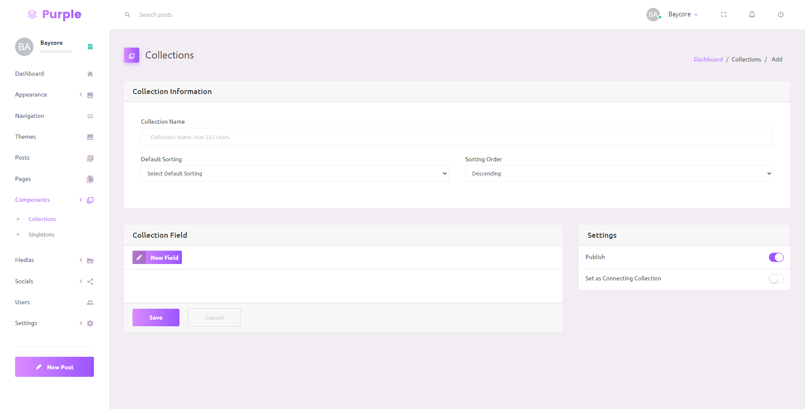
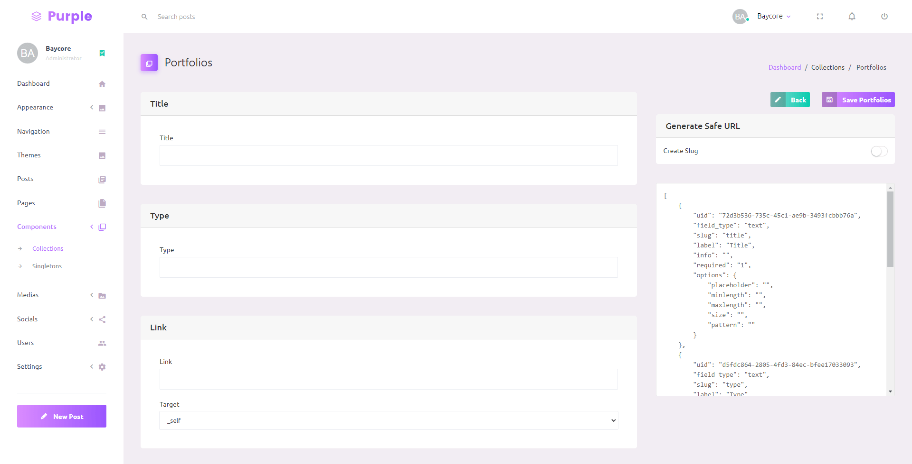

# Headless CMS - Collections

Collections is a different types of content lists. You can create your own schema for your content. Unlike traditional CMS, schema is created in database, but in Headless CMS, you can create schema inside the CMS itself.

Collections is a repeating content. For example, you can create blog posts, portfolios, or gallery with collections. 

## Creating Collection

To create a new Collection, go to **Components** → **Collections**, click Add Colelction button. Fill the Collection Name, and select Default Sorting. Create the collection schema by adding fields in Collection Field. To see all list of fields, go to [Fields](fields.md).

Define a set of fields which define your content schema.

## Adding Data to Collection

To add data to collection, click **View** in the selected collection card, list of data within the collection will be displayed if the collection already has datas. Click Add Data button.

If you plan to make a content that can be accessed from it's slug, for example, a blog post, check the **Create Slug** option, select the target field (usually title or name based on your schema).

### Connecting Collection

Connecting Collection is a collection that can be a schema or field. For example, you want to create a blog post collection which contain a category. To achieve this, create a blog post collection and a category collection as a connecting collection.

When creating a connecting collection, check **Set as Connecting Collection** option to make a connecting collection. And when you create another collection, the collection you created as a connecting collection will be available in the field type.

## Fetch from API

Collections and its datas can be accessed from API. Read the [API Documentation](https://documenter.getpostman.com/view/13404470/Tzm8FFSv#2c598308-816b-429c-9b12-211f1534355e) for more detail. 

