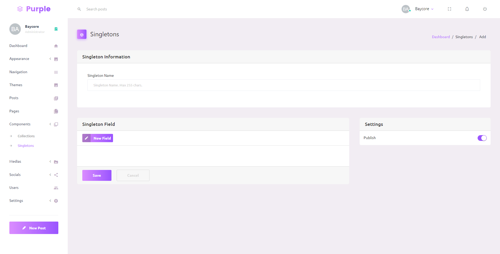
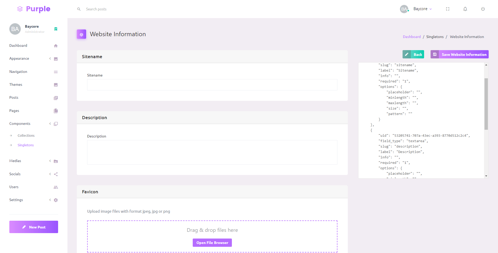

# Headless CMS - Singletons

Singletons is a non-repeating content. For example, Website Information content, which contain sitename, tagline, description, and favicon. 

## Creating Singleton

To create a new Singleton, go to **Components** → **Singletons**, click Add Singleton button. Fill the Singleton Name and create the singleton schema by adding fields in Singleton Field. To see all list of fields, go to [Fields](fields.md).

## Adding Data to Singleton

To add data to singleton, click **View** in the selected singleton card, data within the singleton will be displayed if the singleton already has data. Click Add Data button.

## Fetch from API

Singletons and its data can be accessed from API. Read the [API Documentation](https://documenter.getpostman.com/view/13404470/Tzm8FFSv#ef68c45e-f209-4679-87cb-fb24f5fc2b04) for more detail. 